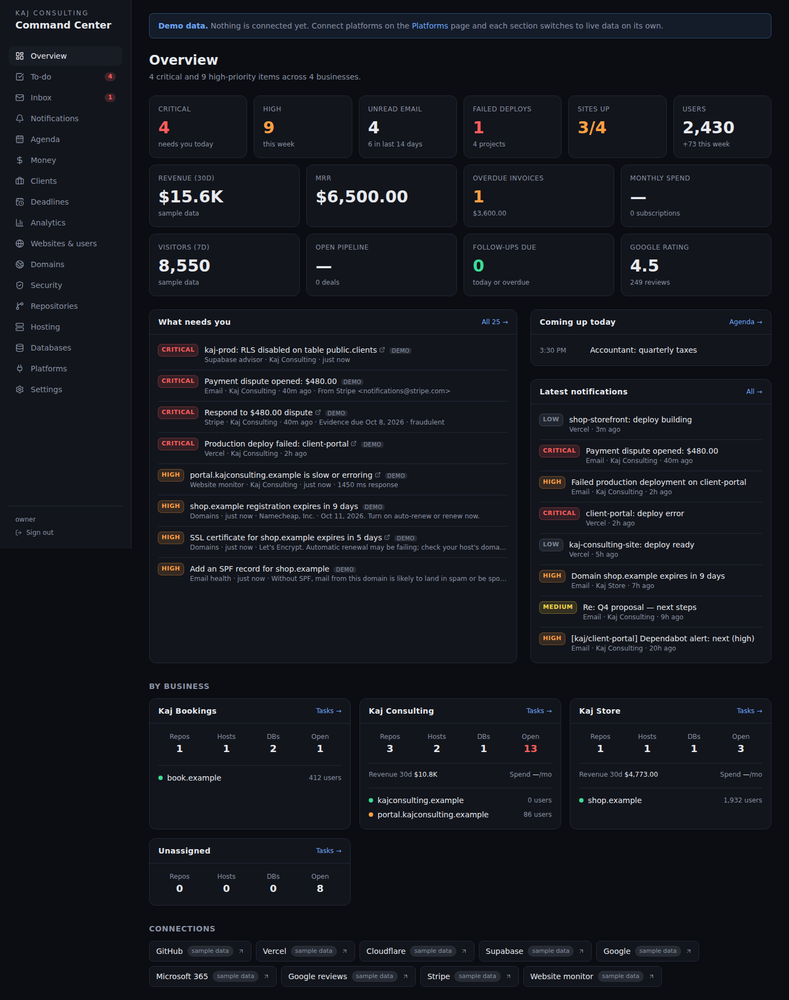

# Kaj Command Center

One private dashboard for every business Kaj Consulting runs: repositories, hosting, databases, email, websites and their users. Everything that needs attention is pulled into one to-do list, ranked by severity, that you can work through.



## What's in it

| Section | What you see and do |
|---|---|
| **Overview** | Critical/high counts, top to-dos, latest notifications, a card per business |
| **To-do** | One list ranked **critical → high → medium → low**. Mark done, snooze (4h to 1 week), reassign to a business, add your own tasks. Open / Snoozed / Done views. |
| **Inbox** | Every connected Gmail mailbox in one list, auto-triaged by urgency |
| **Notifications** | Email, GitHub, Vercel, Stripe, Supabase and uptime events, kept 90 days |
| **Money** | Stripe revenue (30-day chart), net, MRR, balances per business; money owed to you (Stripe + invoices you add); subscriptions with monthly cost per business and renewal dates. Stripe test-mode keys are accepted but kept out of totals and tasks |
| **Deadlines** | Taxes, filings, licenses, insurance, contracts. Repeating ones (monthly / quarterly / yearly) roll forward when done |
| **Domains** | Registration and SSL expiry for every domain, plus SPF / DKIM / DMARC email health, checked twice a day |
| **Security** | Dependabot and leaked-secret alerts, Supabase advisor findings, GitHub 2FA, a 2FA checklist for your other accounts, and this dashboard's own hardening |
| **Websites & users** | Uptime every 5 minutes with a 24-hour history strip, registered users and new sign-ups |
| **Repositories / Hosting / Databases** | GitHub, Vercel, Cloudflare Workers, Supabase (with security advisors), Cloudflare D1 |
| **Platforms** | Connect platforms with one click or an API token, set up webhooks, check the scheduler |
| **Settings** | Businesses, websites, two-factor authentication, sign out everywhere, audit log |

### Where tasks come from

| Origin | Examples | Closes itself when |
|---|---|---|
| **Signals** (checked every 5 min) | Site down, production deploy failed, Supabase RLS disabled, urgent unread email, open PRs | The condition clears. It reopens if the condition comes back. |
| **Money & risk** (Phase 2) | Stripe dispute to answer, invoice overdue (critical after 30 days), subscription renewing in 7 days or expiring with auto-renew off, deadline inside its reminder window, domain or certificate about to expire (or a certificate that is expired or invalid), missing SPF/DMARC, high/critical Dependabot alert | The condition clears (invoice paid, deadline done, domain renewed…) |
| **Webhooks** (real time) | Stripe dispute or failed payout, CI failing on `main`, Dependabot or leaked-secret alert | The platform reports it fixed (dispute closed, CI green, alert fixed) |
| **You** | Anything you add on the To-do page | You mark it done |

When a webhook and polling both see the same dispute, failed invoice or security alert, you get one task, not two, and marking it done keeps it done while the problem persists. If the platform reports it fixed but polling still sees the problem a few minutes later, the polled task appears. Marking a deadline's task done also completes that deadline (repeating ones move to their next date).

Marking a signal task done keeps it done for as long as the condition persists. A source that is temporarily failing (or one failing mailbox, project or repo within it) never auto-closes its tasks; it shows up as a connector error instead. Disconnecting a platform closes its signal tasks.

## Security

- Sign in with Google (allow-listed emails) and/or a password, then **mandatory 2FA** with an authenticator app. Ten single-use recovery codes are issued.
- Sessions are HMAC-signed cookies (7 days). "Sign out of all devices" revokes every session.
- Platform tokens, OAuth refresh tokens, TOTP secrets and webhook secrets are **encrypted with AES-256-GCM** before they reach the database.
- Every webhook is signature-checked. Cron needs `CRON_SECRET`. Failed login and 2FA attempts are rate-limited (a correct one doesn't count). Password sign-in is limited per IP on Vercel, or behind your own reverse proxy with `TRUSTED_PROXY=true`; without a trustworthy IP, all callers share one looser limit (100 failures an hour), and a tripped limit is audited.
- Every sign-in, connection change, setting change and task action goes to the audit log (Settings).
- Row-level security is enabled on all tables, so Supabase's public API keys can't read them.

## Run locally

```bash
npm install
cp .env.example .env.local   # set DASHBOARD_PASSWORD; add REQUIRE_2FA=false to skip 2FA locally
npm run dev                  # http://localhost:3000
```

Without `DATABASE_URL`, an embedded Postgres (PGlite) is created in `.data/`. With nothing connected, every section shows sample data.

```bash
npm test          # unit + database tests (in-memory Postgres)
npm run test:pg   # database tests against a real Postgres (TEST_DATABASE_URL)
npm run typecheck
```

## Deploy (Vercel + Supabase)

1. **Database:** create a Supabase project, or use an existing one. Copy the **transaction pooler** connection string into `DATABASE_URL`. Tables are created on first start.
2. **Secrets:** set `SESSION_SECRET`, `ENCRYPTION_KEY`, `CRON_SECRET`, `APP_URL`, and a sign-in method (`DASHBOARD_PASSWORD` and/or Google + `ALLOWED_EMAILS`). Production refuses to start without the secrets.
3. **Deploy** the repo on Vercel. `vercel.json` schedules `/api/cron/check` every 5 minutes. This needs a Pro plan; on Hobby, change it to daily or call the endpoint from any scheduler with `Authorization: Bearer $CRON_SECRET`.
4. **Sign in**, scan the 2FA QR code, and save your recovery codes.
5. **Platforms page:** connect GitHub, Vercel, Gmail (one per mailbox), Supabase and Cloudflare (one account each; connecting another replaces it), then add the webhook URLs it shows to GitHub, Vercel, Stripe and Supabase.
6. **Settings:** list your businesses and websites.

## Architecture

```
Platforms ─► connectors (src/lib/connectors) ─► collect() ─► persist(): tasks, events, uptime snapshots ─► Postgres
Webhooks ─► /api/webhooks/* (verified) ─► events + event tasks ─────────────────────────────────────────┘
Vercel Cron ─► /api/cron/check ─► collect + persist + cleanup                                pages read ◄┘
```

- `src/lib/connectors/*`: one file per platform, normalized into `src/lib/types.ts`.
- `src/lib/aggregate.ts`: fetches everything and derives tasks (`deriveTasks`).
- `src/lib/server/sync.ts`: persists signals; `store/*` holds the database access; `migrations.ts` holds the schema.
- `src/lib/server/auth.ts`, `twofactor.ts`, `session.ts`: sign-in, 2FA, sessions. `src/proxy.ts` guards every route.

## Adding a platform

1. Write `src/lib/connectors/<name>.ts` returning a shared type via `fromSource(...)`. Read credentials through `src/lib/server/credentials.ts`.
2. Call it from `collect()` in `src/lib/aggregate.ts` and add rules to `deriveTasks` with a new scope.
3. Add it to `PLATFORM_DEFS` in `src/lib/platforms.ts`. For a webhook, add a handler in `webhook-handlers.ts` and a route.

See **[PROPOSAL.md](PROPOSAL.md)** for the roadmap.
